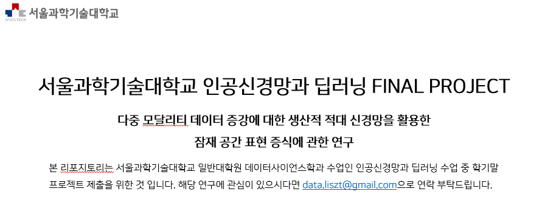

## 실험 소개 
본 연구는 멀티 모달리티 데이터를 어그멘테이션 하는 방법으로써 각 개별 모달리티의 어그멘테이션이 아닌, 멀티 모달리티의 적절한 Common Embedding Space 찾은 후, 
해당 Space에서 GAN을 통해 데이터를 어그멘테이션 하는 방식을 제안한다. 데이터 어그멘테이션은 이미지 데이터에 활발히 사용되고 있으나, 시계열 데이터에 적용하기에
제한적인 사항이 많다. 본 연구에서 제안하는 방법은 데이터 어그멘테이션이 어려운 모달리티들을 적절한게 embedding 시키고, 이러한 Common Space로부터 데이터 증강을 
진행한다. 제안한 방법론을 통해 멀티 모달 분류 과제의 성능이 향상됨을 확인할 수 있었다. 

## 제안 방법 - 모델 파이프라인 

본 연구에서 제안하는 모델 파이프라인은 다음과 같다. 

- 먼저 Convolution Neural Network(이하 CNN)와 Recurrent Neural Network(이하 RNN)를 통해 이미지와 생육 데이터 csv파일을 input으로 받아 처리한다. 이떄 각각의 Network는 각 모달리티 데이터를 축소하게되며, 하나의 데이터로 concat하게 된다. 

- concat된 데이터는 Generative Adversarial Network(이하 GAN)의 Input으로 들어가게된다. 이는 서로 다른 모달리티의 데이터가 **하나의 space로 embedding** 된다. 이렇게 embedding space가 잘 형성된다면 즉, **서로 다른 모달리티의 데이터가 잘 축소되고 결합되어 적절한 representation을 갖는다면**, **GAN과 해당 embedding space를 활용하여 새로운 데이터를 생성**할 수 있을 것이다.  

- 이후 **원본 데이터(X_train)**와 **GAN을 통해 생성된 새로운 데이터(generated_data)**를 합하여 새롭게 분류 task를 진행하게 된다. 이는 **Data Augmentation**이라 할 수 있으며, 특히 멀티 모달리티의 **Common Space로부터 데이터를 생성한 것이기 때문에**, Data Augmentation이 제한적인 모달리티의 Augmentation을 새로운 방식으로 진행한 것이라 할 수 있다.  

