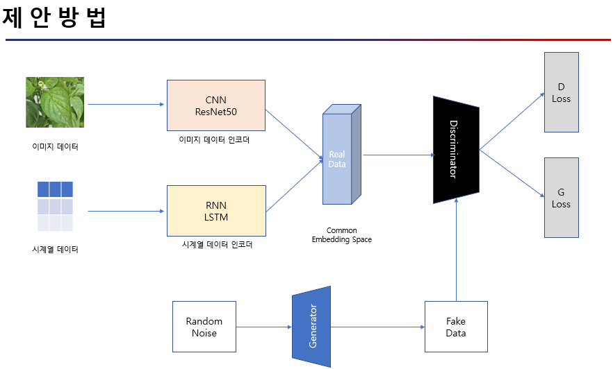
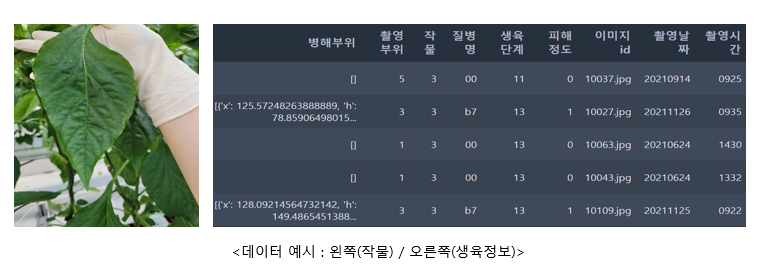

# GAN for data augmentation in multi-modal deeplearing

## 실험 소개 
Generative Adversarial Network(이하 GAN)을 사용하여 멀티 모달 데이터 증강에 대한 실험:
- 각 개별 모달리티의 어그멘테이션이 아닌, 멀티 모달리티의 적절한 Common Embedding Space 찾은 후, GAN을 통해 해당 space에서 데이터를 생성하는 방식 
- 데이터 어그멘테이션은 이미지 데이터에 활발히 사용되고 있으나, 시계열 데이터에 적용하기에 제한적인 사항이 많음 
- 본 실험에서 제안하는 방법은 데이터 어그멘테이션이 어려운 모달리티를 common space projection 시키고, 이러한 common Space로부터 데이터를 생성하는 방식  

## 제안 방법 - 모델 파이프라인 

실험에 적용된 모델 파이프라인은 다음과 같다. 

- 먼저 Convolution Neural Network(이하 CNN)와 Recurrent Neural Network(이하 RNN)를 통해 이미지와 생육 데이터 csv파일을 input으로 받아 처리한다. 이때 각 모델은 feature extraction하는 인코더로써 사용됨. 위의 그림과 같이 **common embedding space**에서 feature concatenation하게 됨. 서로 다른 모달리티의 데이터가 **하나의 space로 embedding** 되는 과정임.

- Feature concatenation된 데이터는 Generative Adversarial Network(이하 GAN)의 Discriminator의 real label로 사용됨. 이렇게 embedding space가 잘 형성된다면 즉, **서로 다른 모달리티의 데이터가 잘 축소되고 결합되어 적절한 representation이 생성된다면**, **GAN과 해당 embedding space를 활용하여 새로운 데이터를 생성**할 수 있음. 

- 이후 **원본 데이터(X_train)**와 **GAN을 통해 생성된 새로운 데이터(generated_data)**를 합하여 새롭게 분류 task를 진행하게 됨. 이는 **Data Augmentation**이라 할 수 있으며, 특히 멀티 모달리티의 **common Space로부터 데이터를 생성한 것이기 때문에**, Data Augmentation이 제한적인 모달리티의 augmentation을 common space projection을 통해 진행한 것으로 볼 수 있음.

## 실험 데이터 

본 실험에서는 데이콘과 LG에서 제공하는 [농업 환경 변화에 따른 작물 병해 진단](https://dacon.io/competitions/official/235870/overview/description) 데이터를 활용하였음.

- 데이터는 작물들의 정상 및 질병 상태를 나타내고 있음. 질병은 초기/중기/말기 3 단계로 이루어져 있음. 
- 이미지 데이터 : 작물 또는 작물들의 잎사귀 
- csv 데이터 : 작물들의 시계열 생육정보 

    > 본 실험에서는 파프리카 작물에 대한 데이터만 선정하여 실험을 진행했음. 파프리카 작물 데이터가 정상 및 질병의 초기/중기/말기로 잘 구분되어 있기 때문임. 

 
## 실험 결과 

실험 결과 기존 딥러닝 Baseline 모델을 통해 분류 Task를 진행한 것 보다, 제안한 방법인 **GAN AUGMENTATION**을 활용한 것이 더 높은 분류 성능이 나온다는 것을 확인할 수 있었다.

|         Model(Method)         |        F1 SCORE(MICRO)      |
|-------------------------------|-----------------------------|
|-------------------------------|-----------------------------|
|Baseline (No AUGMENTATION)     |           90.24             |
|Baseline + GAN AUGMENTATION    |           92.12             |

## 파일 설명 

- etc_file : Train data의 생육환경 Feature들의 MinMax 값 저장 (csv_feature_dict3.pickle) | 라벨 데이터 (json_files3.pickle)

- generated_data : GAN을 통해 생성된 데이터 

- pca_data : Baseline의 인코더 파트만을 분리해 X_train 데이터를 차원축소한 데이터. 이는 GAN으로 부터 생성된 데이터와 같은 크기의 차원으로 축소되며, 추후 해당 데이터와 GAN데이터를 결합하여(이는 데이터 증강이라 볼 수 있음) 분류 task를 진행 

- model_save 
    - CNN2RNN.pt : Baseline 모델 
    - MLP : 1) GAN으로 생성된 데이터와  2) Baseline의 인코더 모델을 통해 X_train을 차원 축소한 데이터를 분류할 새로운 모델. 즉 Common Embedding Space로 부터 생성된 데이터와 원본데이터의 차원축소 데이터를 정상 및 질병 초기/중기/말기로 구분할 모델 
    - discriminator / generator : GAN 모델 

- baseline.ipynb : baseline 모델 

- gan_training.ipynb : GAN 훈련 

- proposed_method_inference.ipynb : 제안한 방법론을 통해 분류태스크 진행 
